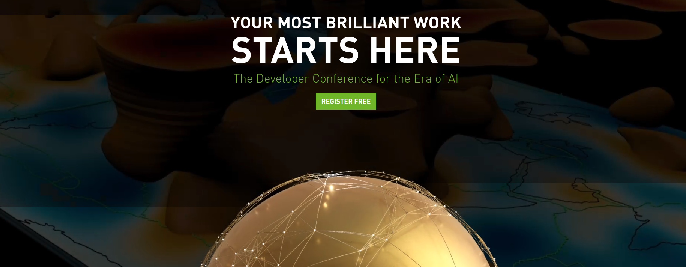

# Nvidia GTC Conference 

NVIDIA GTC es una conferencia global de IA para desarrolladores que reúne a desarrolladores, ingenieros, investigadores,
inventores y profesionales de TI. Los temas se centran en inteligencia artificial (IA), gráficos por computadora, 
ciencia de datos, aprendizaje automático y máquinas autónomas.

NVIDIA GTC regresa del **21 al 24 de marzo de 2022** con una tonelada de contenido y oradores nuevos y emocionantes.

Todo es gratis para asistir. La conferencia presenta una exhibición de lo último en desarrollo de IA con el 
discurso de apertura el 22 de marzo, a cargo del CEO y fundador de NVIDIA, Jensen Huang. Toda la semana tiene
de más de 900 sesiones que cubren vehículos autónomos, IA, supercomputación y más.

**El registro es hasta antes de la medianoche PST del jueves 24 de marzo de 2022**. Obtendrá acceso completo a todo el 
contenido de GTC durante 30 días después del evento. 

**Si tiene alguna pregunta, contácte a GTC_Content@nvidia.com**

     

[cult]: https://www.nvidia.com/gtc/session-catalog/?tab.scheduledorondemand=1583520458947001NJiE#/

## Indice

1 Natural Lenguage processing (NLP)
2 Deep Learning
3 Jetson

## Conferencias

### Natural Lenguage processing (NLP)

<b>Building Transformer-Based Natural Language Processing Applications</b>

- **Abstract**:
    
    Aprenderá a utilizar modelos de NLP basados en Transformer para clasificación de texto, reconocimiento de entidades
nombradas (NER) y cómo analizar varias funciones, restricciones y características del modelo para determinar qué 
modelo es el más adecuado para un caso de uso particular en función de las métricas, la especificidad del dominio, 
y los recursos disponibles.
  
- [Link de acceso](https://www.nvidia.com/gtc/session-catalog/?ncid=em-even-599637&mkt_tok=MTU2LU9GTi03NDIAAAGDCQVhcx-WP4kU_zHRbnXQjM18hyk3_Q8Cx99DTRvxwXsjwYEb5NeL_ZXlnFlT41Qhh-2UwKbpFO7U8FIgHIJ8lgleZhO3EZzOYa7DkMeUBypMCIPQgw&tab.day=20220320&search.primarytopic=16246413645860062Bum&search.primarytopic=16246413645860432IyF&search.primarytopic=16246413645860482iUS&search.primarytopic=16246413645860132WWK&search.primarytopic=162464136458601222RK&search.primarytopic=16246413645860102sI4&search.primarytopic=1626470117021001aYK9&search.primarytopic=16246413645860202msC&search.primarytopic=16246413645860212MnD&search.primarytopic=16246413645860222JUI#/session/1642539479394001Ujuj)
- [Link de acceso](https://www.nvidia.com/gtc/session-catalog/?search=&tab.day=20220321#/session/1641595052951001RA8J)
- [Link de acceso](https://www.nvidia.com/gtc/session-catalog/?search=&tab.day=20220321#/session/16383079137440019GJ6)

<b>Bridging the Gap Between Basic Neural Language Models, Transformers, and Megatron</b>

- **Abstract**:

    The Transformer architecture has been instrumental in driving Deep Learning (DL) based Natural Language Processing (NLP) progress since its introduction in 2017. In particular, it cracked the problem of how to apply transfer learning to NLP. This enabled using vast amounts of publicly available textual data to pretrain models before applying them to domain specific problems. Over the past few years, models based on the Transformer architecture have scaled to ever larger problem sizes. Examples of such models are BERT, GPT-1/2/3, and NVIDIA's Megatron. Pretrained versions of these models are publicly available and can be used as-is to solve NLP tasks, or they can be further fine-tuned for the end application. Although the Transformer architecture has been around for almost five years, our impression is that it still seems mysterious to many developers. In this session we will address this by connecting the dots between basic neural language models and the Transformer architecture. We will also describe how NVIDIA’s Megatron implementation enables the Transformer to scale to a huge number of GPUs.

- [Link de acceso](https://www.nvidia.com/gtc/session-catalog/?search=&tab.day=20220321#/session/1638834529505001nmKV)

<b>Building Conversational AI Applications</b>

- **Abstract**:

    Learn how to quickly build and deploy production quality conversational AI applications with real-time transcription and natural language processing (NLP) capabilities.

- [Link de acceso](https://www.nvidia.com/gtc/session-catalog/?search=&tab.day=20220321#/session/1642539479948001UG6v)

<b>GTC Session Watch Party: How Transformers and ASR Are Changing How We Search</b>

- **Abstract**:

    Discover the possibilities of natural language processing for enterprise search systems using the unmatched abilities of Transformers models and NVIDIA infrastructure for semantic search and question answering. We'll deep dive into how Transformers using the power of the NVIDIA DGX A100 lead to more precise search results and answers. We'll also show how you can build and combine a semantic search and question-answering pipelines using open-source frameworks together with the NVIDIA deep learning software stack to reach a production-grade deployment system delivering state-of-the-art search results. Finally, we'll show how SOTA automatic speech recognition (ASR) models created with NVIDIA TAO can be deployed using NVIDIA Riva Triton Server to provide fast input to these search systems.

- [Link de acceso](https://www.nvidia.com/gtc/session-catalog/?search=&tab.day=20220325&search.primarytopic=1626470117021001aYK9#/session/1646729421352001lbH3)

### Deep Learning

<b>The State of PyTorch</b>

- **Abstract**:

    The PyTorch community and ecosystem has seen immense growth in 2021, all thanks to our community of contributors. In this talk, Chris Gottbrath surveys who is building on PyTorch and shares a perspective on how the PyTorch team is using an intentional focus on improving usability to empower community collaborations. He will also review the key new features added to PyTorch and the core ecosystem libraries and frameworks in early 2022 and highlight how PyTorch is leveraging some of the most important developments in GPU accelerated computing to enable large scale training and production deployments across different industries.

- [Link de acceso](https://www.nvidia.com/gtc/session-catalog/?search=&tab.day=20220322#/session/16389025633190018bTO)

<b>Fundamentals of Deep Learning</b>

- **Abstract**:
    Discover how deep learning works through hands-on exercises in computer vision and natural language processing. You’ll train deep learning models from scratch, learning tools and tricks to achieve highly accurate results. You’ll also learn to leverage freely available, state-of-the-art pre-trained models to save time and get your deep learning application up and running quickly.
  
- [Link de acceso](https://www.nvidia.com/gtc/session-catalog/?search=&tab.day=20220320#/session/1641595051842001RZi5)

<b>Connect with the Experts: Deep Learning, Machine Learning, and Data Science</b>

- **Abstract**:

    We’re hosting an interactive session with NVIDIA experts so that you can get your toughest questions answered. Join us to attend one-to-one chats or group sessions to discuss your projects and challenges with our experts. Example topics include state-of-the-art algorithms and tools for computer vision, natural language processing, automatic speech recognition, text-to-speech, recommender systems, reinforcement learning, and more.

- [Link de acceso](https://www.nvidia.com/gtc/session-catalog/?search=&tab.day=20220322#/session/16433856909010015UsI)

<b>Design, Train, and Evaluate Domain-specialized Health-care Imaging AI Models with MONAI</b>

- **Abstract**:

    Learn about designing, training, and evaluating domain-specialized health-care imaging AI models using MONAI. Researchers and data scientists need a common foundation to perform training experiments and compare against the state of the art. MONAI provides domain-specific implementations to help kick-start development and research, including new features like self-supervised learning, Transformer-based Networks for Medical Imaging (UNETR), and DiNTS, a new neural architecture search method. We'll introduce MONAI Core and then dive deep into the more technical features of MONAI, with a hands-on walkthrough of Self-Supervised Learning, AutoML/DiNTS, and researcher best practices.

- [Link de acceso](https://www.nvidia.com/gtc/session-catalog/?search=&tab.day=20220322#/session/1639272007766001cMQD)

<b>Faster Neural Network Training, Algorithmically</b>

- **Abstract**:

    Training modern neural networks is time-consuming, expensive, and energy-intensive. As neural network architectures double in size every few months, it's difficult for researchers and businesses without immense budgets to keep up. I'll describe one approach for managing this challenge: changing the training algorithm itself. While many companies and researchers are focused on building hardware and systems to allow existing algorithms to run faster in a mathematically equivalent fashion, there's nothing sacred about this math. To the contrary, training neural networks is inherently approximate, relying on noisy data, convex optimizers in nonconvex regimes, and ad hoc tricks and hacks that seem to work well in practice for reasons that elude us. I'll explain how we've put this approach into practice at MosaicML, including the dozens of algorithmic changes we've studied (which are freely available open source), the science behind how these changes interact with each other (the composition problem), and how we evaluate whether these changes have been effective. I'll also detail several surprises we encountered and lessons we learned along the way. In the four months since we began this work in earnest, we've reduced the training times of standard computer vision models by 3-4x and standard language models by 2x on publicly available cloud instances, and we believe we're just scratching the surface. I'll close by laying out the road ahead for this agenda, and issue a call to action on several specific research problems that merit the attention of the research community.

- [Link de acceso](https://www.nvidia.com/gtc/session-catalog/?search=&tab.day=20220322#/session/1635975950144001iO6H)

<b></b>

- **Abstract**:

- [Link de acceso]()

<b></b>

- **Abstract**:

- [Link de acceso]()

### Jetson 

<b>GTC Session Watch Party: Getting Started with Edge AI on Jetson</b>

- **Abstract**:

    Interested in developing and deploying your own AI-powered applications to edge devices and autonomous robots? Join us for this session to get started with deep learning, computer vision, and conversational AI brought to the embedded NVIDIA Jetson platform. Learn how to train customized DNN models and deploy them into your own projects with real-time inferencing and minimal latency. Quickly take your designs into production using off-the-shelf solutions and pre-packaged systems. Following the presentation, we'll be taking live Q&A from the audience. We look forward to answering your questions!

- [Link de acceso](https://www.nvidia.com/gtc/session-catalog/?search=&tab.day=20220322#/session/1646726451959001caQe)

<b>Deep Dive Into Jetson and DeepStream</b>

- **Abstract**:

    Learn how NVIDIA DeepStream and Graph Composer make it easier than ever to create vision AI applications for NVIDIA Jetson. Using a low-code approach and visual programming, Graph Composer allows users to create real-time computer vision pipelines using DeepStream plug-ins and deploy them using containers—all without writing a single line of code. We'll take you through the process of developing, testing, and deploying a video AI application with Graph Composer. We'll cover how to work with extensions, how to leverage pre-trained models or use your own, best practices for development, and more. Come and learn how Graph Composer and DeepStream can help developers of all backgrounds harness the power of AI.

- [Link de acceso](https://www.nvidia.com/gtc/session-catalog/?search=&tab.day=20220321&search.primarytopic=162464136458601222RK#/session/1643325955833001jpd5)

<b>How To Develop and Optimize Edge AI apps with NVIDIA DeepStream </b>

- **Abstract**:

    Learn how the latest features of DeepStream are making it easier than ever to achieve real-time performance even for complex video AI applications. Deep-dive into a multi-sensor, multi-model design and learn how to work with the latest sensors, models, and trackers to reduce development time and maximize performance using AI at the edge.

- [Link de acceso](https://www.nvidia.com/gtc/session-catalog/?search=&tab.day=20220321&search.primarytopic=162464136458601222RK#/session/1638559072282001rcYZ)

<b>Connect with the Experts: Develop with NVIDIA DeepStream</b>

- **Abstract**:

    Check out the latest DeepStream features and learn best development practices when you use DeepStream. Engage with NVIDIA's DeepStream experts and the developer community.

- [Link de acceso](https://www.nvidia.com/gtc/session-catalog/?search=&tab.day=20220323&search.primarytopic=162464136458601222RK#/session/163854288272500127ii)

## Sample 

<b></b>

- **Abstract**:

- [Link de acceso]()

### A revisar despues

- [Lab para acelerar ML system components](https://www.nvidia.com/gtc/session-catalog/?search=&tab.day=20220323&search.primarytopic=16246413645860152cF1#/session/1639692289352001CUFS)
- [Aplicaciones de AI en deteccion de anomalias](https://www.nvidia.com/gtc/session-catalog/?search=&tab.day=20220321#/session/16383079139180019jq9)
- [Mantenimiento predictivo](https://www.nvidia.com/gtc/session-catalog/?search=&tab.day=20220321#/session/1641595053216001R96K)
- [Sistema recomendador DL](https://www.nvidia.com/gtc/session-catalog/?search=&tab.day=20220322#/session/1638047853433001KoWn)
- [Sistema recomendador con Merlin](https://www.nvidia.com/gtc/session-catalog/?search=&tab.day=20220322#/session/1634769053862001L2XY)
- [Elegir GPU en AWS](https://www.nvidia.com/gtc/session-catalog/?search=&tab.day=20220322#/session/1642709374838001J0pj)

### RL

- [nuevo gym para RL](https://www.nvidia.com/gtc/session-catalog/?search=&tab.day=20220322#/session/1638331324610001KvlV)
- [Gran turismo champion](https://www.nvidia.com/gtc/session-catalog/?search=&tab.day=20220322#/session/1639352867042001iDRi)

## Otros interesantes

- [Intrduccion de Jetson ADX Orin](https://www.nvidia.com/gtc/session-catalog/?search=&tab.day=20220322#/session/16388268966250016f1r)
- [Meeting con expertos Fast image proc/augment](https://www.nvidia.com/gtc/session-catalog/?search=&tab.day=20220323&search.primarytopic=16246413645860132WWK#/session/16376889511360018qsQ)
- [creacion de modelos con TAO](https://www.nvidia.com/gtc/session-catalog/?search=&tab.day=20220322#/session/16467277381420014Yus)
- [TAO para AI con minimo codigo](https://www.nvidia.com/gtc/session-catalog/?search=&tab.day=20220321#/session/1638558655345001OWir)
- [Image retrieval for landmark recognition](https://www.nvidia.com/gtc/session-catalog/?search=&tab.day=20220321#/session/1642070974818001HAFA)
- [Introduccion a vehiculos autonomos](https://www.nvidia.com/gtc/session-catalog/?search=&tab.day=20220321#/session/1643244158271001WkUI)
- [ECG con DL](https://www.nvidia.com/gtc/session-catalog/?search=&tab.day=20220322#/session/1638778994886001TtkQ)

